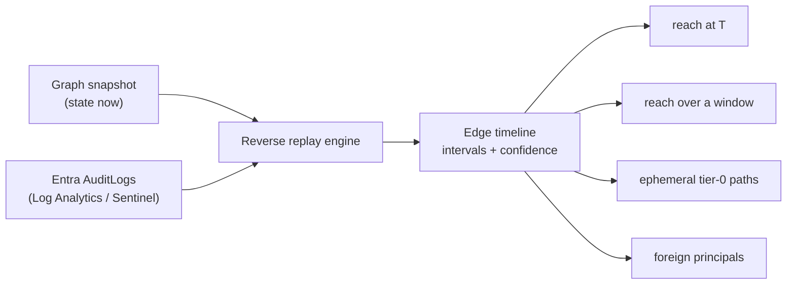

# Identity Time Machine

[](https://github.com/KanenasCS/identity-time-machine/actions/workflows/tests.yml)


**See the Microsoft Entra ID identity graph as it was at any moment, and find the privileged access that came and went.**

An attacker adds a compromised account to a group nested under Global Administrator, plants a secret on a privileged app, then removes the group membership to cover their tracks. Every current-state tool (attack path graphs, role reviews, exposure dashboards) looks at the tenant today and sees nothing wrong.

Identity Time Machine rebuilds the graph from a snapshot of today plus your Entra audit logs. It answers the questions an incident responder actually asks:

* What could this account reach at the moment it was compromised?
* Which tier-0 paths existed at any point in the last 90 days, but not anymore?
* Who held privileged roles from outside this directory, and since when?

```text
$ itm ephemeral --from 2026-07-01T00:00:00Z --hide-pim

ext.contractor@contoso.com -> Global Administrator  2026-07-08T10:00:00Z .. 2026-07-22T17:00:00Z  (14d 7h)  [medium]
    ext.contractor@contoso.com -member_of-> IT-Admins -has_role-> Global Administrator
partner-escalation (foreign) -> Application Administrator  2026-08-12T10:00:00Z .. 2026-08-12T16:00:00Z  (6h)  [high]
    partner-escalation (foreign) -has_role-> Application Administrator
Ivan Petrov -> Cloud Application Administrator  2026-08-25T10:00:00Z .. 2026-08-28T16:00:00Z  (3d 6h)  [high]
    Ivan Petrov -owns-> Reporting-Tool -backs-> Reporting-Tool (SP) -has_role-> Cloud Application Administrator
Dave Miller -> Global Administrator  2026-09-02T02:14:00Z .. 2026-09-02T04:31:00Z  (2h 17m)  [high]
    Dave Miller -member_of-> Tier0-Ops -member_of-> IT-Admins -has_role-> Global Administrator
Dave Miller -> Privileged Role Administrator  2026-09-02T02:40:00Z .. 2026-09-05T11:00:00Z  (3d 8h)  [high]
    Dave Miller -holds 952ef7e4..-> Backup-Automation -backs-> Backup-Automation (SP) -has_role-> Privileged Role Administrator
```

Today, Dave Miller holds no roles at all:

```text
$ itm reach dave.miller@contoso.com --at 2026-09-26T07:00:00Z
no roles reachable
```

## Features

* **Point-in-time graph.** Reconstruct group memberships, directory roles, app and service principal ownership, and credentials at any timestamp inside your log retention.
* **Ephemeral path detection.** Find tier-0 access that existed for minutes, hours or days and was then removed, with the exact path and duration.
* **Temporally correct reachability.** Paths are only reported when every edge existed at the same moment. Merging all edges seen in a window invents paths that never existed, and the tool shows you the difference (`--naive`).
* **Foreign principal detection.** Roles held by groups and identities from other tenants (partner, delegated admin and governance relationships) are identified and treated as actors.
* **Confidence on every edge.** Each interval carries high, medium or low confidence plus a note explaining how its start and end were determined.
* **Read-only and dependency-free.** Pure Python standard library. Reads Microsoft Graph and your existing Log Analytics or Sentinel workspace. Writes nothing to the tenant.

## Install

```bash
pip install git+https://github.com/KanenasCS/identity-time-machine
```

Requires Python 3.9 or later. For app-based authentication, install the optional extra: `pip install "identity-time-machine[sdk] @ git+https://github.com/KanenasCS/identity-time-machine"`.

## Usage

You need Entra audit logs flowing into a Log Analytics workspace (the `AuditLogs` table, as with Microsoft Sentinel). Your lookback equals that table's retention.

**1. Snapshot the tenant as it is now**

```bash
az login --tenant <tenant-id>
itm-collect --out anchor.json --tenant <tenant-id>
```

**2. Export the audit logs** (about 30 minutes later, to allow for ingestion delay)

```bash
az monitor log-analytics query -w <workspace-id> --timespan P90D \
  --analytics-query "$(cat queries/auditlogs_export.kql)" -o json > auditlogs.json
```

**3. Investigate**

```bash
itm --anchor anchor.json --logs auditlogs.json summary
itm --anchor anchor.json --logs auditlogs.json ephemeral --from 2026-07-01T00:00:00Z
itm --anchor anchor.json --logs auditlogs.json reach alice@contoso.com --at 2026-09-02T03:00:00Z
```

## Commands

| Command | What it answers |
|---|---|
| `summary` | Log window, parse statistics, foreign principals, reconciliation conflicts |
| `ephemeral --from T1 [--to T2] [--hide-pim]` | Tier-0 access that existed in the window but not now |
| `reach PRINCIPAL --at T` | Every role a principal could reach at a moment, with the path |
| `window-reach PRINCIPAL --from T1 [--to T2] [--naive]` | Everything a principal could reach at any moment in a window |
| `state-at T [--type TYPE]` | Every edge in the graph at a moment |
| `history OBJECT` | Every interval that touched a user, group, app or role |
| `foreign` | Roles held by principals outside this directory, over time |
| `replay-check --baseline OLDER_ANCHOR` | Verifies reconstruction against an earlier snapshot |
| `itm-collect` | Takes the read-only Graph snapshot |
| `itm-shapes LOGS` | Redacted structure report of an audit log export, safe to share |

Principals can be given as display name, UPN, object ID, or an object ID prefix of at least 8 characters.

## How it works



The snapshot is ground truth for now. The engine walks audit events from newest to oldest and inverts each one: undoing an add closes an interval, undoing a removal opens one. The result is a validity interval for every edge. Queries evaluate reachability at each moment the graph changed, so every reported path existed as a whole.

When a removal was never logged, the end is inferred from the strongest available evidence and the confidence is lowered accordingly. Details are in [docs/how-it-works.md](docs/how-it-works.md).

## Permissions

| Mode | Requirement |
|---|---|
| `--auth cli` (default) | Signed-in user with at least **Global Reader**, token from Azure CLI |
| `--auth sdk` | App registration with `User.Read.All`, `GroupMember.Read.All`, `Application.Read.All`, `RoleManagement.Read.Directory` (application permissions) |
| Log export | Read access to the workspace that holds `AuditLogs` |

## Coverage

| Relationship | Status |
|---|---|
| Group membership, including nesting | Supported |
| Directory role assignments, active and PIM activations | Supported |
| Application and service principal ownership | Supported |
| Application and service principal secrets and certificates | Supported |
| Foreign principals holding roles | Supported |
| App role assignments (Graph application permissions) | Planned |
| Federated identity credentials | Planned |
| Group ownership | Planned |
| Delegated permission grants | Planned |
| Azure RBAC | Planned |

Two boundaries apply by design. The lookback can never exceed your `AuditLogs` retention, and a relationship granted before that window and removed without any logged event cannot be recovered from logs alone.

## Data handling

Snapshots and log exports contain identity data from your tenant. Keep them internal. The repository `.gitignore` excludes them by default. When sharing diagnostics, use `itm-shapes`, which removes object IDs, UPNs, IP addresses and display names.

## Documentation

* [How it works](docs/how-it-works.md): replay algorithm, inference rules, duplicate handling, foreign detection
* [Testing](docs/testing.md): offline test suite and verifying reconstruction on your own tenant
* [Troubleshooting](docs/troubleshooting.md): permissions, ingestion delay, shells, parser validation

## Contributing

Issues and pull requests are welcome. Run `python synthetic/run_all.py` before submitting. Never attach real tenant files. See [SECURITY.md](SECURITY.md) for reporting vulnerabilities.

## License

MIT. See [LICENSE](LICENSE).
